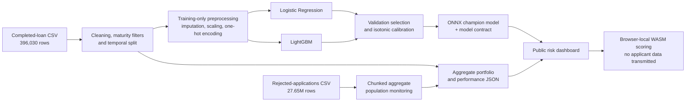

# Northstar Risk — Lending Club Underwriting Lab

Northstar Risk is an end-to-end credit-risk research project built on the
[Lending Club loan dataset](https://www.kaggle.com/datasets/wordsforthewise/lending-club).
It combines portfolio analytics, probability-of-default (PD) modeling,
out-of-time validation, policy simulation, and browser-based applicant scoring
in one public dashboard.

**Live dashboard:** [northstar-risk-underwriting.azure10h.chatgpt.site](https://northstar-risk-underwriting.azure10h.chatgpt.site)

> [!WARNING]
> This project is for research and demonstration only. The model did not pass
> all validation gates and must not be used for real lending decisions,
> adverse-action notices, or production credit policy.

## Executive summary

The project answers two related questions:

1. What historical risk patterns are visible across Lending Club originations
   and rejected applications?
2. Given application-time borrower and loan attributes, what is the estimated
   probability that a completed loan will charge off?

Two candidate models—regularized Logistic Regression and LightGBM—are trained
on the same leakage-controlled feature set. Both are calibrated with isotonic
regression, and the champion is selected using validation ROC-AUC with an
explicit preference for the more interpretable Logistic Regression when its
performance is within 0.01 of LightGBM.

LightGBM is the selected research champion. On the out-of-time test cohort it
achieves a ROC-AUC of **0.6671**, PR-AUC of **0.3332**, and KS of **0.2448**.
At the dashboard's illustrative 15% PD cutoff, the policy approves **47.10%**
of the labeled test cohort, with a **13.11%** observed bad rate among approved
loans, while capturing **71.77%** of charged-off loans in the policy-rejected
subset.

The model is exported to ONNX and executed entirely in the visitor's browser.
Applicant inputs are not transmitted to an application server.

## Project deliverables

- Portfolio overview covering loan volume, loss rates, grades, terms, purposes,
  and home-ownership segments.
- Model-performance workspace with candidate comparison, calibration, and
  decision-threshold analysis.
- Applicant decision simulator returning calibrated PD, a research policy
  signal, a risk score, input warnings, and applicant-specific sensitivity
  factors.
- Rejected-application population monitoring and data-coverage analysis.
- Model-governance view documenting included features, leakage exclusions,
  limitations, and validation status.
- Reproducible Python training pipeline and deployable ONNX/WASM inference
  artifacts.

## Data

### Source populations

| Population | Records | Date range | Use in this project |
| --- | ---: | --- | --- |
| Completed loans | 396,030 | Jun 2007–Dec 2016 | Portfolio EDA and labeled modeling source |
| Charged-off loans | 77,673 | Jun 2007–Dec 2016 | Positive target observations |
| Maturity-eligible loans | 313,116 | Through term-specific cutoffs | Model-development population |
| Rejected applications | 27,648,741 | 2007–2018 | Aggregate monitoring and unlabeled selection-bias sensitivity |

The completed-loan portfolio contains **$5.59B** in originated principal and an
observed bad rate of **19.61%**.

Rejected applications represent approximately **$363.12B** in requested
principal. They do not have subsequent Lending Club repayment outcomes, so they
are never labeled as good or bad and are excluded from primary PD-model
training and evaluation. Treating rejection as default would create a false
target. Their common application-time characteristics are used separately in
an inverse-propensity-weighting sensitivity challenger.

### Outcome definition

The binary target is defined only for terminal loan outcomes:

- `0` — `Fully Paid`
- `1` — `Charged Off`

The modeling population is maturity-filtered relative to a Q4 2018 observation
window:

- 36-month loans must have been issued by December 31, 2015.
- 60-month loans must have been issued by December 31, 2013.

This reduces right-censoring risk by preventing relatively recent loans from
being treated as successful simply because they had not yet reached a terminal
outcome.

### Temporal development split

Each term is split chronologically rather than randomly so the test set better
represents deployment into later cohorts.

| Split | Rows | Bad rate | Purpose |
| --- | ---: | ---: | --- |
| Training | 105,410 | 14.54% | Fit preprocessing and candidate models |
| Validation | 110,909 | 16.52% | Fit calibration and select the champion |
| Out-of-time test | 96,797 | 21.88% | Final performance and policy assessment |

The increasing bad rate across time is an important sign of population and
outcome drift. It also explains why test-set calibration is materially weaker
than calibration measured on the validation sample used to fit the isotonic
mapping.

## Exploratory data analysis

Several historical patterns stand out:

- **Term:** 60-month loans have a **31.94%** bad rate, approximately twice the
  **15.77%** observed for 36-month loans.
- **Grade:** observed bad rates rise monotonically from **6.29%** for Grade A
  to **47.84%** for Grade G. Grade is useful for portfolio EDA but excluded from
  the model because it is an output of Lending Club's underwriting process.
- **Purpose:** debt consolidation is the largest segment with **234,507**
  loans and a **20.74%** bad rate. Small-business loans have a higher
  **29.45%** bad rate.
- **Home ownership:** renters show a **22.66%** bad rate versus **16.96%** for
  mortgage holders and **20.68%** for owners.
- **Selected-feature missingness:** `mort_acc` has the largest missing share at
  **9.54%**. `pub_rec_bankruptcies` is missing for **0.14%** and `revol_util`
  for **0.07%**.
- **Rejected-population coverage:** the rejected-file `Risk_Score` field is
  populated for only **33.10%** of applications overall and varies sharply by
  year—from more than 90% in several early cohorts to **6.83%** in 2018. It is
  therefore unsuitable as a consistent target or default risk measurement.
- **Geography:** California, Texas, Florida, and New York account for the
  largest rejected-application volumes. Geography is monitored only in
  aggregate and is excluded from underwriting inputs.

These are descriptive associations, not causal effects. Several segments also
reflect Lending Club's historical underwriting and pricing policies.

## Data preparation

The training pipeline performs the following steps:

1. Parse `issue_d` and `earliest_cr_line` as dates.
2. Normalize `term` to 36- or 60-month categories.
3. Trim categorical text and map missing employment length to
   `Missing/Unknown`.
4. Construct the terminal-outcome target from `loan_status`.
5. Apply term-specific maturity cutoffs.
6. Split each term chronologically into training, validation, and test cohorts.
7. Median-impute numeric features using training-sample statistics.
8. Replace missing categorical values with `Missing/Unknown`.
9. Standardize numeric inputs and one-hot encode categorical inputs.
10. Ignore unseen categories safely at inference time rather than failing.

All preprocessing parameters are fitted on the training cohort and then reused
for validation, testing, and browser inference.

## Feature selection

Feature selection is deliberately **domain- and leakage-driven**, not an
automated recursive-elimination exercise. A variable is retained only when it
is plausibly available at application time, reproducible in the browser, and
appropriate for a research underwriting model.

### Included application-time features

The model starts from 17 raw features and produces 48 encoded model inputs.

| Numeric features (11) | Categorical features (6) |
| --- | --- |
| `loan_amnt` | `term` |
| `annual_inc` | `emp_length` |
| `dti` | `home_ownership` |
| `open_acc` | `verification_status` |
| `pub_rec` | `purpose` |
| `revol_bal` | `application_type` |
| `revol_util` |  |
| `total_acc` |  |
| `mort_acc` |  |
| `pub_rec_bankruptcies` |  |
| `credit_history_years` |  |

### Excluded variables

The model intentionally excludes:

- Target leakage: loan status and any post-origination outcome variables.
- Lending Club decision outputs: grade, sub-grade, interest rate, installment,
  and initial listing status.
- Direct location and proxy fields: raw address, ZIP code, and state.
- High-cardinality or unstructured text: employment title and free text.

These exclusions reduce target leakage, underwriting-policy leakage, proxy
risk, instability, and the gap between offline training and the information
available in the live simulator. Grade remains visible in EDA because it is
valuable for historical portfolio analysis, but it is never passed to the
model.

Protected-class attributes are not present in the supplied files. Their absence
does not demonstrate fairness; it prevents a complete fair-lending assessment.

## Feature engineering

The pipeline uses a limited, auditable set of transformations:

- `credit_history_years` is derived from the interval between the issue date
  and earliest reported credit line, clipped at zero.
- `term` is extracted and normalized to a consistent categorical value.
- Employment length is normalized and missing values receive an explicit
  category.
- Numeric values are median-imputed and standardized.
- Categorical values are one-hot encoded.
- Training-sample 1st, 50th, and 99th percentiles are stored in the browser
  model contract to flag unusual or out-of-distribution applicant inputs.
- Raw model probabilities are mapped through isotonic regression to produce
  calibrated PD estimates.

No synthetic features based on grade, pricing, location, or post-origination
performance are introduced.

## Candidate models

### Regularized Logistic Regression

Logistic Regression is the interpretable industry baseline. Numeric
standardization, one-hot encoding, and L2 regularization (`C=0.2`) provide a
stable linear relationship between application attributes and log-odds of
default.

### LightGBM

LightGBM is the nonlinear challenger. It can capture interactions and
non-monotonic relationships without manually specifying them. The configured
model uses 350 trees, a 0.03 learning rate, 31 leaves, maximum depth 6,
minimum 100 observations per leaf, row/column subsampling, and L1/L2
regularization.

### Champion selection

Candidates are trained on identical observations and features. Each candidate
is calibrated with isotonic regression fitted on the validation cohort.

The model with the higher validation ROC-AUC wins unless the difference is less
than 0.01, in which case Logistic Regression is preferred for interpretability.
LightGBM's validation ROC-AUC is **0.6611** versus **0.6497** for Logistic
Regression, a difference of approximately **0.0115**. It therefore exceeds the
interpretability preference margin and becomes the champion.

### Reject-inference sensitivity challenger

The monitoring workspace includes a post-stratification
inverse-propensity-weighting (IPW) analysis. Historical booked and rejected
applications are grouped using four fields available in both files:
application year, requested amount, DTI, and employment length. Observed booked
outcomes are then reweighted toward the rejected-applicant profile.

The dashboard exposes weight caps of 3×, 5×, 10×, and 20×. Higher caps allow
historically underrepresented application cells to exert more influence but
reduce effective sample size and increase variance. The 10× scenario, for
example, reduces the effective training population from 105,410 to about
68,878, changes mean absolute test PD by 1.95 percentage points, and lowers
test ROC-AUC from 0.6671 to 0.6632.

This is a selection-bias stress test, not labeled reject inference. Performance
is still evaluated only on booked loans with observed outcomes, so it cannot
establish how rejected applicants would actually have performed.

## Model performance

### Out-of-time test comparison

| Model | ROC-AUC | PR-AUC | KS | Brier score | ECE |
| --- | ---: | ---: | ---: | ---: | ---: |
| Logistic Regression | 0.6611 | 0.3314 | 0.2389 | 0.1641 | 4.40% |
| **LightGBM (champion)** | **0.6671** | **0.3332** | **0.2448** | **0.1635** | **4.43%** |

- **ROC-AUC** measures rank-order discrimination across all thresholds.
- **PR-AUC** is informative when charged-off loans are the minority class.
- **KS** is the maximum separation between the cumulative good and bad score
  distributions.
- **Brier score** evaluates squared probability error; lower is better.
- **Expected calibration error (ECE)** summarizes the difference between
  predicted and observed default rates across probability buckets.

### Why accuracy is not the headline metric

Plain accuracy depends on a single cutoff and can be misleading in an
imbalanced credit-risk setting. At the illustrative 15% PD cutoff, LightGBM
has:

- Accuracy: **56.63%**
- Recall / bad capture: **71.77%**
- Specificity: **52.38%**
- Precision among policy-rejected observations: **29.69%**

The relatively modest accuracy is not hidden; it is interpreted alongside
ranking, calibration, approval, and loss outcomes. A lending model is useful
only when its cutoff is tied to economics, risk appetite, and operational
capacity—not when it maximizes accuracy in isolation.

### Calibration

The out-of-time test population reveals material calibration drift. For
example, the middle calibration buckets have observed bad rates several
percentage points above predicted PD. Overall test ECE is **4.43%** for
LightGBM.

This is why the interface labels the output as a research signal rather than a
validated recommendation.

## Research decision policy

The dashboard's default scenario approves an application when calibrated
`PD <= 15%`. On the labeled out-of-time test cohort:

| Policy outcome | Result |
| --- | ---: |
| Historical approval rate | 47.10% |
| Observed bad rate among approved loans | 13.11% |
| Charged-off loans captured in policy-rejected subset | 71.77% |

The cutoff can be adjusted from 5% to 30% in the dashboard for scenario
analysis. Moving the threshold changes the policy decision, not the model or
its estimated PD.

The 15% cutoff is illustrative. It was not optimized against funding cost,
pricing, expected loss, capital, profitability, fairness, or operational
constraints.

## Validation status

The research validation gates are:

| Gate | Requirement | LightGBM test result | Status |
| --- | ---: | ---: | --- |
| ROC-AUC | >= 0.65 | 0.6671 | Pass |
| KS | >= 0.25 | 0.2448 | **Fail** |
| ECE | <= 3.00% | 4.43% | **Fail** |
| Brier | Better than outcome-rate baseline | 0.1635 | Pass |

Because not all gates pass, model version `LC-PD-2026.07-v1` is marked
**NOT VALIDATED**.

## System architecture



The public deployment contains only:

- Aggregate portfolio and model-performance JSON.
- A preprocessing/model contract containing feature definitions and training
  statistics.
- The champion ONNX model.
- The ONNX Runtime Web WASM assets.
- Static application code and images.

Raw Lending Club CSV files, fitted Python objects, and model-training
intermediates remain outside the website's public build.

## Privacy and security

Applicant inputs are transformed and scored in the browser. The current
application does not send those values to an API, analytics endpoint, or
database. This improves demo privacy, but it also means the public ONNX model
and preprocessing contract can be downloaded by any visitor.

Client-side inference is not a substitute for production security. A real
underwriting system would require authenticated access, server-side policy
controls, tamper-resistant decisioning, audit records, data retention rules,
and monitored integrations.

## Limitations

1. **Historical data:** the latest source observations are from 2018 Q4 and do
   not represent current borrower behavior, inflation, interest rates, policy,
   or macroeconomic conditions.
2. **Selection bias:** repayment outcomes exist only for accepted loans.
   Declined applicants may follow a different risk distribution.
3. **Outcome censoring:** maturity filters reduce but do not eliminate all
   cohort and servicing effects.
4. **Calibration drift:** the later test cohort has a substantially higher bad
   rate and fails the calibration gate.
5. **Fair-lending validation:** protected-class fields are unavailable, so
   disparate-impact, proxy, and segment-performance testing is incomplete.
6. **Policy dependence:** observed grades and outcomes reflect Lending Club's
   historical selection, pricing, and servicing processes.
7. **Reason codes:** applicant-specific sensitivity factors are research
   explanations, not governed adverse-action reason codes.
8. **No profitability model:** the policy does not incorporate pricing,
   recovery, prepayment, funding cost, capital, or expected profit.
9. **No independent validation:** development and validation are contained in
   one research project.

## Future enhancements

Prioritized next steps are:

1. Retrain on current institutional application and performance data with
   verified observation windows and outcome definitions.
2. Add rolling or nested temporal cross-validation and Optuna-based
   hyperparameter tuning without contaminating the final holdout.
3. Evaluate monotonic LightGBM, Explainable Boosting Machines, traditional
   scorecards, and calibrated XGBoost as champion–challenger candidates.
4. Add global SHAP analysis, stability-tested explanations, and a governed
   mapping from model drivers to compliant reason codes.
5. Introduce PSI/CSI drift monitoring, out-of-range rates, missingness alerts,
   segment discrimination, segment calibration, and outcome backtesting.
6. Perform fair-lending and proxy analysis using legally permitted demographic
   or proxy-testing data, with compliance and legal review.
7. Test reject inference only as a sensitivity analysis; never treat rejected
   applications as known defaults.
8. Optimize the cutoff using expected loss, profitability, funding capacity,
   pricing, and risk appetite rather than a fixed demonstration threshold.
9. Add authenticated server-side decision orchestration, immutable audit logs,
   model/version lineage, approvals, rollback, and independent validation
   before any production use.

## Run locally

Requirements:

- Node.js 22.13 or newer
- Python 3 with the packages in `requirements.txt` if rebuilding the model

```bash
npm install
npm run dev
```

The local development server prints the URL to open.

## Build and test

```bash
npm test
```

The test command builds the deployable application and checks that the rendered
workspace and public model artifacts are present without shipping source
records.

## Rebuild model artifacts

Place the two Lending Club CSV files in the parent directory:

- `lending_club_loan_two.csv`
- `rejected_2007_to_2018Q4.csv`

Then run:

```bash
python3 -m venv --system-site-packages .venv
.venv/bin/pip install -r requirements.txt
.venv/bin/python scripts/train_model.py --data-dir ..
```

The training process writes:

- Aggregate dashboard data to `public/data/`.
- ONNX and preprocessing contract artifacts to `public/model/`.
- Local Python validation artifacts to the ignored `artifacts/` directory.

Raw CSV files remain outside the website project and are never copied into the
public build.

## Repository structure

```text
app/                  Dashboard interface and client-side scoring
docs/MODEL_CARD.md    Compact model-governance summary
public/data/          Aggregate portfolio and model-performance data
public/model/         ONNX model and browser preprocessing contract
scripts/              Training and artifact-validation pipelines
tests/                Build and public-artifact checks
```

## Responsible-use statement

This repository demonstrates a model-development and monitoring workflow. It
does not establish creditworthiness, satisfy model-risk-management
requirements, validate fair lending, or provide legally sufficient
adverse-action reasons. Production use would require current data, documented
business policy, compliance approval, independent validation, security
controls, auditability, and ongoing outcome monitoring.
